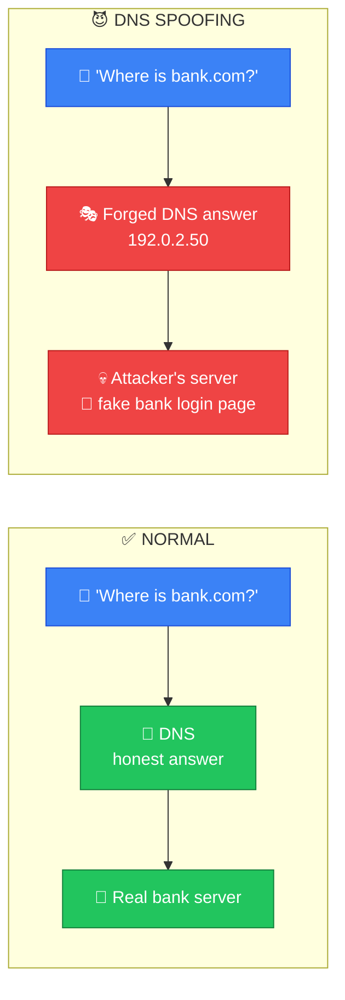
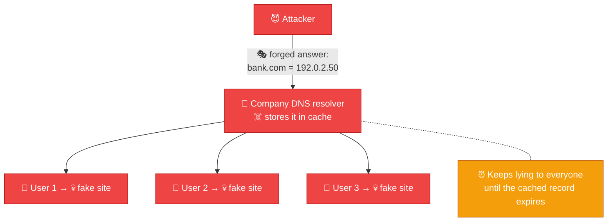
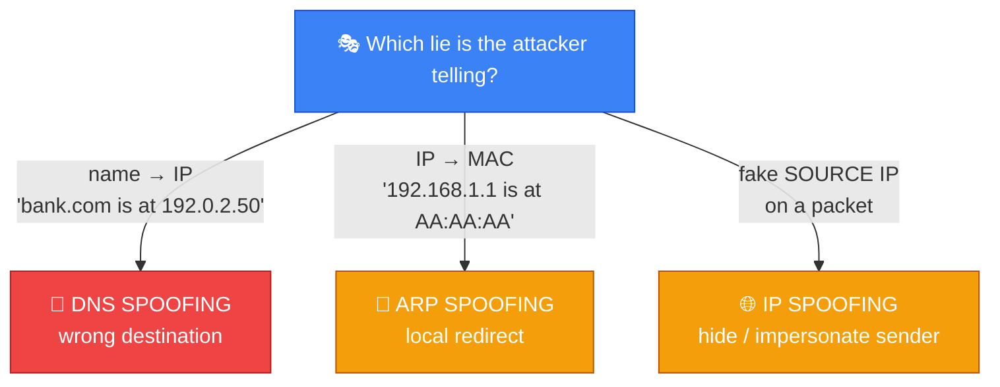
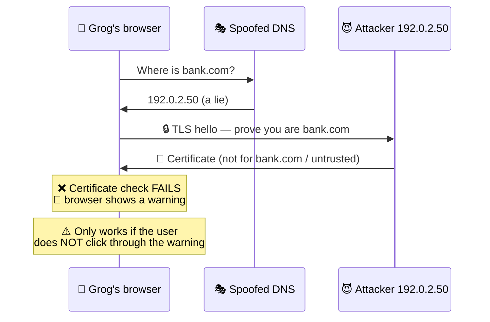

# 🎭 DNS Spoofing — Caveman Style

**Section:** Common Network Attacks &nbsp;·&nbsp; **Topic:** 96 of 290 &nbsp;·&nbsp; **Level:** 🟢 Beginner

**DNS spoofing** is when an attacker **causes a DNS lookup to return a false or malicious IP address**.

Think:

> 🪨 Grog asks: **"Where is the real bank cave?"**

> DNS is supposed to point Grog to the real cave.

> 😈 Attacker lies: **"Bank cave is over there!"**

> Grog goes to the **attacker's fake cave**.

---

# 🧠 First: What Does DNS Do?

**DNS = Domain Name System**

Humans like **names**:

```
www.example.com
```

Computers communicate using **IP addresses**:

```
93.184.216.34
```

DNS **connects the two**:

```
🌐 www.example.com
       ↓
      DNS
       ↓
📍 93.184.216.34
```

Think:

> **DNS = Internet phone book**

---

# 😈 Now DNS Spoofing

Normally:

```
👤 User
  ↓
"Where is bank.com?"
  ↓
🔎 DNS
  ↓
🏦 Real bank IP
```

With DNS spoofing:

```
👤 User
  ↓
"Where is bank.com?"
  ↓
😈 False DNS answer
  ↓
💀 Attacker's IP
  ↓
🎣 Fake website
```

The victim **thinks they're going to the legitimate site**.



---

# 🎣 Example

Grog types:

```
https://mybank.com
```

The browser **needs the IP address**.

The attacker causes DNS to return:

```
mybank.com
     ↓
192.0.2.50   ← Attacker's server
```

Instead of:

```
mybank.com
     ↓
🏦 Legitimate bank server
```

Grog **may be sent to a phishing site**.

---

# 🎯 The Key Exam Idea

Memorize:

> **DNS spoofing = false DNS answer**

Or:

> 🔎 **"Wrong name → wrong IP."**

---

# 🧠 DNS Spoofing vs DNS Poisoning

You'll often hear these terms **together**.

### DNS spoofing

Broadly means:

> **Providing a forged/fake DNS response.**

### DNS cache poisoning

Means:

> **Putting a malicious/incorrect DNS record into a DNS cache, so future users receive the false answer.**

Think:

```
🎭 DNS Spoofing
= Lie about the answer

☠️ DNS Cache Poisoning
= Put the lie into the cache
```

In some security materials, the terms are **used loosely or interchangeably**, so follow the wording of the question.



> 🧠 **Spoofing lies once. Poisoning puts the lie in the cache — so it hits every user of that resolver.**

---

# 🆚 DNS Spoofing vs ARP Spoofing

This is a **very useful comparison**.

### 🎭 ARP Spoofing

Attacker lies about:

> **IP → MAC**

```
192.168.1.1
     ↓
😈 Attacker MAC
```

Goal:

> **Redirect local network traffic.**

### 🎭 DNS Spoofing

Attacker lies about:

> **Domain name → IP**

```
bank.com
   ↓
😈 Attacker IP
```

Goal:

> **Redirect users to the wrong destination.**

### 🧠 Memory:

> **ARP = "Who owns this IP on my local network?"**

> **DNS = "What IP belongs to this name?"**

---

# 🆚 DNS Spoofing vs IP Spoofing

**Don't confuse these.**

### DNS spoofing

Changes the **DNS answer**:

```
bank.com → WRONG IP
```

### IP spoofing

Forges the **source IP address** in a packet:

```
Packet:
Source IP = FAKE
```

So:

> 🔎 **DNS spoofing = fake destination information through DNS**

> 🎭 **IP spoofing = fake source IP**



---

# 🆚 DNS Spoofing vs Phishing

They **can work together**, but they **aren't the same**.

### 🎣 Phishing

**Tricks the user** into interacting with something malicious.

### 🎭 DNS spoofing

**Manipulates DNS resolution** to send the user to an incorrect IP.

Example:

```
🎭 DNS Spoofing
      ↓
bank.com
      ↓
😈 Fake bank server
      ↓
🎣 Phishing page
```

So **DNS spoofing can facilitate phishing**.

---

# 🔐 Does HTTPS Stop DNS Spoofing?

**Not completely.**

DNS spoofing **can still cause the user to be directed toward the wrong IP**.

However, properly configured **HTTPS/TLS certificate validation** makes it **much harder** for an attacker to successfully impersonate the legitimate HTTPS website.

For example:



The browser **should warn the user** rather than silently treating the attacker's site as the legitimate site.

### 🧠 Important:

> **DNS spoofing redirects.**

> **TLS/certificate validation helps prevent successful HTTPS impersonation.**

---

# 🛡️ How Can DNS Spoofing Be Reduced?

Common defenses include:

## 🔐 DNSSEC

DNSSEC provides **cryptographic authentication of DNS data**, helping a resolver **verify that DNS responses are authentic and haven't been altered**.

Think:

> 🛡️ **"Prove this DNS answer is genuine."**

## 🔒 Secure DNS transport

Technologies such as **DoT (DNS over TLS)** and **DoH (DNS over HTTPS)** **encrypt DNS traffic** between the client/resolver or application and resolver, helping protect against certain forms of interception.

But:

> ⚠️ **Encryption of DNS traffic and DNSSEC solve different problems.**

## 🧹 Secure DNS caches

**Proper DNS resolver configuration and cache management** can reduce poisoning risks.

## 📊 Network monitoring

Look for **suspicious DNS responses or unexpected DNS infrastructure**.

| Defense | What it protects | Think |
| --- | --- | --- |
| 🔐 **DNSSEC** | **Authenticity/integrity** of DNS answers | "Is this answer genuine?" ✍️ |
| 🔒 **DoT / DoH** | **Confidentiality** of DNS traffic in transit | "Can anyone read/intercept my lookup?" 🙈 |
| 🧹 **Secure resolver config** | The **cache** | "Don't store lies" |
| 🔒 **HTTPS certificate checks** | The **website connection** after a bad redirect | "Is this really bank.com?" 🪪 |

---

# 🎯 Exam Scenarios

### Scenario 1

> A user requests `bank.com`, but a malicious DNS server returns the attacker's IP address.

→ 🎭 **DNS spoofing**

### Scenario 2

> An attacker inserts a false DNS record into a resolver's cache.

→ ☠️ **DNS cache poisoning**

### Scenario 3

> An attacker sends a fake ARP response claiming to own the gateway's IP.

→ 🎭 **ARP spoofing**

### Scenario 4

> An attacker creates a fake website designed to steal credentials.

→ 🎣 **Phishing**

### Scenario 5

> An attacker changes the source IP address in a packet.

→ 🎭 **IP spoofing**

---

## 🧪 Quick Check

**1. What is DNS spoofing?**
<details><summary>Answer</summary>An attack that causes a DNS lookup to return a false IP address, redirecting users to an attacker-controlled destination.</details>

**2. What is the difference between DNS spoofing and DNS cache poisoning?**
<details><summary>Answer</summary>Spoofing = giving a forged DNS answer. Cache poisoning = getting that false record stored in a resolver's cache, so every later user of that resolver gets the lie until it expires.</details>

**3. Why can DNS cache poisoning affect many users at once?**
<details><summary>Answer</summary>The poisoned resolver serves the cached false record to everyone who queries it, not just one victim.</details>

**4. What does ARP spoofing lie about, compared with DNS spoofing?**
<details><summary>Answer</summary>ARP spoofing lies about IP → MAC on the local network. DNS spoofing lies about domain name → IP.</details>

**5. How can DNS spoofing help a phishing attack?**
<details><summary>Answer</summary>The user types the real domain, but DNS sends them to the attacker's server hosting a fake login page — so the phishing site looks like the genuine address.</details>

**6. True or False: HTTPS completely stops DNS spoofing.**
<details><summary>Answer</summary>False. The user can still be redirected to the wrong IP. HTTPS certificate validation makes impersonation fail and triggers a browser warning — as long as the user doesn't click through it.</details>

**7. Which defense verifies that a DNS answer is authentic and unaltered?**
<details><summary>Answer</summary>DNSSEC.</details>

**8. How do DoT/DoH differ from DNSSEC?**
<details><summary>Answer</summary>DoT/DoH encrypt DNS traffic in transit (confidentiality). DNSSEC cryptographically authenticates DNS data (authenticity/integrity). They solve different problems.</details>

## 🧠 Remember This

```
🔎 DNS
Domain name → IP address

🎭 DNS SPOOFING
Domain name → FALSE IP address

☠️ DNS CACHE POISONING
False DNS information → stored in cache

🎭 ARP SPOOFING
IP address → FALSE MAC address

🎭 IP SPOOFING
Packet → FALSE source IP

🎣 PHISHING
Trick the user into giving information
```

> 🛡️ **DNSSEC = genuine answers · DoT/DoH = private lookups · HTTPS certs = catch the impostor site**

### 🔥 The exam sentence:

> **DNS spoofing is an attack in which an attacker causes a DNS query to return a fraudulent IP address, potentially redirecting users from a legitimate service to an attacker-controlled destination.**
