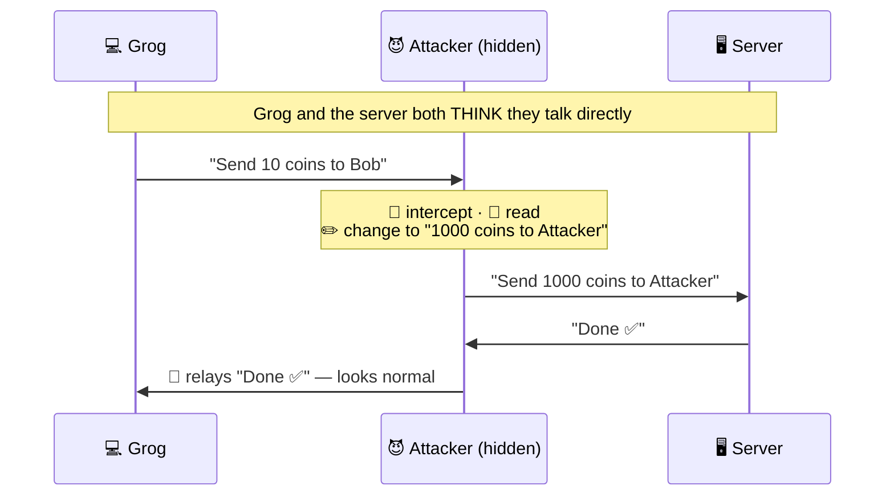
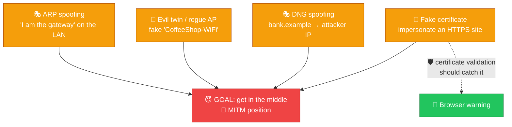
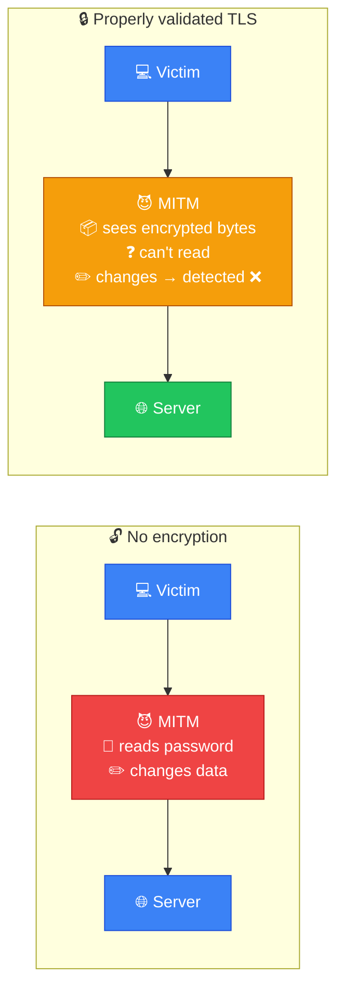
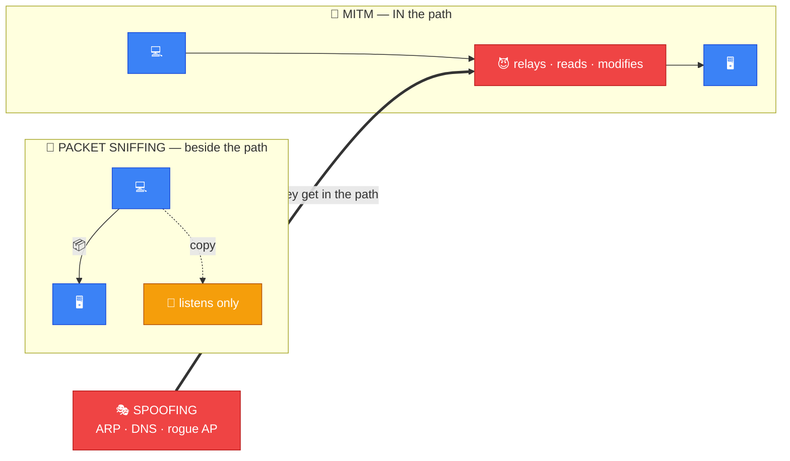

# 👤 Man-in-the-Middle (MITM) Attack — Caveman Style

**Section:** Common Network Attacks &nbsp;·&nbsp; **Topic:** 97 of 290 &nbsp;·&nbsp; **Level:** 🟢 Beginner

A **Man-in-the-Middle attack** happens when an attacker **secretly gets between two parties communicating** and can potentially **intercept, read, or modify** their traffic.

Think:

> 🪨 Grog thinks he is talking **directly** to his friend.

> 😈 The attacker **secretly stands between them** and passes messages back and forth.

```
Normal:

💻 Grog ─────────────────→ 🖥️ Server


MITM:

💻 Grog ─────→ 😈 Attacker ─────→ 🖥️ Server
              ↕
          intercept /
          possibly modify
```

---

# 🧠 The Key Exam Idea

> **MITM = attacker gets between two communicating parties.**

The attacker may:

- 👀 Intercept traffic
- 📖 Read traffic if it isn't adequately protected
- ✏️ Modify traffic
- 🔁 Relay traffic
- 🎭 Impersonate one side to the other

The exact capabilities **depend on the attack and the security controls in place**.



---

# 🪨 Simple Example

Grog wants to access a website:

```
💻 Grog
   ↓
🌐 Website
```

An attacker positions themselves between Grog and the website:

```
💻 Grog
   ↓
😈 Attacker
   ↓
🌐 Website
```

Grog **may still see the website normally**.

That's what makes MITM dangerous:

> **The victim may not realize someone is sitting in the middle.**

---

# 🎭 How Does an Attacker Get in the Middle?

Several techniques can potentially **enable MITM positioning**.

## 1. 🎭 ARP Spoofing

On an IPv4 local network, the attacker can **manipulate ARP mappings** so traffic intended for the gateway is redirected through the attacker.

```
Victim
  ↓
😈 Attacker
  ↓
Router
```

## 2. 📶 Rogue / Evil-Twin Wi-Fi

The attacker creates a **malicious wireless access point that looks like a legitimate network**.

```
💻 Victim
   ↓
📡 Fake Wi-Fi
   ↓
😈 Attacker
   ↓
🌐 Internet
```

## 3. 🎭 DNS Spoofing

The attacker causes a **domain name to resolve to an incorrect IP address**, potentially directing the victim toward an attacker-controlled system.

```
bank.example
     ↓
😈 Wrong IP
```

## 4. 🔐 TLS/Certificate Attacks

If an attacker attempts to **impersonate a secure website**, **proper certificate validation should detect the mismatch**.



---

# 🔓 Unencrypted vs Encrypted Traffic

This is **very important for exams**.

## Without effective encryption

```
💻 Victim
   ↓
📄 Unencrypted data
   ↓
😈 MITM
   ↓
🌐 Server
```

The attacker **may be able to read or modify** the traffic.

## With properly validated TLS

```
💻 Victim
   ↓
🔒 TLS
   ↓
😈 MITM
   ↓
🌐 Server
```

The attacker can potentially **capture** the encrypted traffic, but **cannot simply read or successfully modify** the protected application data without defeating the cryptographic protections.



---

# 🛡️ How Do You Defend Against MITM?

## 🔐 Use encryption

Use protocols such as:

- HTTPS/TLS
- SSH
- Secure VPNs where appropriate

## ✅ Validate certificates

Browsers use **certificate validation** to help ensure that an HTTPS connection is **actually associated with the intended domain**.

## 📶 Secure Wi-Fi

Use **properly configured modern Wi-Fi security** rather than connecting to unknown or suspicious access points.

## 🛡️ Network protections

Depending on the environment:

- Dynamic ARP Inspection
- DHCP snooping
- Network segmentation
- Monitoring for anomalous traffic

| Attacker technique | Defense that counters it |
| --- | --- |
| 🎭 ARP spoofing | **Dynamic ARP Inspection + DHCP snooping** |
| 📶 Evil twin / rogue AP | **Secure Wi-Fi (WPA2/WPA3-Enterprise), don't join unknown networks** |
| 🎭 DNS spoofing | **DNSSEC · HTTPS certificate checks** |
| 🔐 Fake certificate | **Certificate validation — never click through warnings** |
| 📖 Reading/altering data | **Encryption: HTTPS/TLS · SSH · VPN** |

---

# 🆚 MITM vs Packet Sniffing

**Don't confuse them.**

### 👃 Packet sniffing

**Capture and inspect** traffic.

```
💻 ─────📦─────→ 🖥️
          👃
```

### 👤 MITM

**Get between** the communicating parties.

```
💻 ───→ 😈 ───→ 🖥️
```

MITM **can include traffic interception**, but **simply capturing packets isn't necessarily a MITM attack**.

---

# 🆚 MITM vs Spoofing

### 🎭 Spoofing

**Pretend to be someone/something else.**

Examples:

- IP spoofing
- ARP spoofing
- DNS spoofing

### 👤 MITM

**Position yourself between two parties** and intercept/relay their communication.

**Spoofing techniques can therefore be used to enable MITM.**



---

# 🎯 Exam Scenarios

### Scenario 1

> An attacker secretly intercepts communication between a client and server and can alter the messages.

→ 👤 **Man-in-the-Middle**

### Scenario 2

> An attacker tricks a victim's computer into associating the gateway's IP with the attacker's MAC address.

→ 🎭 **ARP spoofing**

This can enable:

→ 👤 **MITM**

### Scenario 3

> An attacker captures unencrypted network traffic but isn't positioned between the endpoints.

→ 👃 **Packet sniffing**, not necessarily MITM.

### Scenario 4

> An attacker creates a fake Wi-Fi network to intercept users' connections.

→ 📶 **Evil Twin / Rogue AP**, potentially enabling MITM.

### Scenario 5

> A browser rejects a website because its certificate doesn't match the requested domain.

→ 🔐 **TLS/certificate validation** is helping defend against impersonation/MITM.

---

## 🧪 Quick Check

**1. What is a Man-in-the-Middle attack?**
<details><summary>Answer</summary>An attack where the attacker secretly positions themselves between two communicating parties to intercept, read, modify or relay their traffic.</details>

**2. Why is MITM hard for victims to notice?**
<details><summary>Answer</summary>The attacker relays messages both ways, so the connection still appears to work normally.</details>

**3. Name three techniques an attacker can use to get into the middle.**
<details><summary>Answer</summary>Any three of: ARP spoofing, evil twin / rogue Wi-Fi access point, DNS spoofing, impersonating a site with a fake certificate.</details>

**4. At a coffee shop, a laptop joins "CoffeeShop-Free-WiFi" set up by an attacker. What is this, and what can it enable?**
<details><summary>Answer</summary>An evil twin / rogue access point — it can enable a MITM attack on everyone who connects.</details>

**5. An attacker captures unencrypted traffic from a network tap but never sits between the endpoints. Is that MITM?**
<details><summary>Answer</summary>Not necessarily — that's packet sniffing. MITM means being positioned in the communication path.</details>

**6. What is the relationship between spoofing and MITM?**
<details><summary>Answer</summary>Spoofing (ARP, DNS, rogue AP) is often the technique used to get into the middle; MITM is the resulting position.</details>

**7. If the victim uses properly validated TLS, what can the MITM attacker still do and not do?**
<details><summary>Answer</summary>They can capture the encrypted traffic, but can't read the protected content, and any modification is detected.</details>

**8. A browser shows "Your connection is not private — certificate does not match." Why should the user not click "proceed anyway"?**
<details><summary>Answer</summary>The warning may mean a MITM attacker is impersonating the site. Certificate validation is the defense — clicking through defeats it.</details>

**9. What are the two main defenses against MITM?**
<details><summary>Answer</summary>Strong encryption plus proper authentication of the endpoint (e.g. certificate validation) — backed by secure Wi-Fi and network controls like Dynamic ARP Inspection.</details>

## 🧠 Remember This

```
👤 MITM
│
├── Attacker gets BETWEEN two parties
│
├── Can potentially:
│   ├── 👀 Intercept
│   ├── 📖 Read
│   ├── ✏️ Modify
│   └── 🔁 Relay
│
├── Possible enabling techniques:
│   ├── 🎭 ARP spoofing
│   ├── 🎭 DNS spoofing
│   └── 📶 Evil Twin / Rogue AP
│
└── Main defense:
    🔐 Encryption + proper authentication
```

### 🔥 One-line exam answer:

> **A Man-in-the-Middle attack occurs when an attacker positions themselves between two communicating parties to intercept and potentially modify or relay their communications, with strong encryption and endpoint authentication helping prevent the attacker's access to protected content.**
