# 🌊 DDoS — Caveman Style

**Section:** Common Network Attacks &nbsp;·&nbsp; **Topic:** 98 of 290 &nbsp;·&nbsp; **Level:** 🟢 Beginner

**DDoS = Distributed Denial-of-Service**

It is an attack where **many devices send huge amounts of traffic or requests toward a target** to **overwhelm its resources**, making the service **slow or unavailable to legitimate users**.

Think:

> 🪨 One caveman knocks on Grog's cave door → no big problem.

> 🪨🪨🪨🪨🪨🪨🪨 **Thousands of cavemen all knock at once** → Grog can't answer anyone.

```
🪨  🪨  🪨  🪨
  🪨  🪨  🪨
🪨  🪨  🪨  🪨
       ↓
       ↓
   🎯 Web Server
       💥
    OVERWHELMED
```

---

# 🧠 The Key Exam Idea

> **DDoS = many sources overwhelm a target so legitimate users cannot access the service.**

The three important words:

### Distributed

Traffic comes from **many different systems**, often a **botnet**.

### Denial

The attack **prevents or degrades access**.

### Service

The target is usually a:

- 🌐 Website
- 🖥️ Server
- 🌎 Network
- ☁️ Cloud service
- 🎮 Online service

---

# 🤖 Where Do All These Devices Come From?

Attackers may control a **botnet**.

A **botnet** is a **collection of compromised devices controlled by an attacker**.

```
💻 Bot
📱 Bot
💻 Bot
📷 Bot
🖥️ Bot
   ↓
   ↓
   ↓
🎯 Target
```

The devices might **belong to ordinary users who don't realize their systems have been compromised**.

<p align="center"></p>

---

# 🆚 DoS vs DDoS

This distinction is **very important**.

### DoS

**Denial-of-Service**

**One source** attacks the target.

```
😈
 ↓
🎯 Server
```

### DDoS

**Distributed Denial-of-Service**

**Many sources** attack the target.

```
😈 😈 😈 😈 😈
 \  |  |  |  /
       ↓
    🎯 Server
```

### 🧠 Memory:

> **DoS = one/fewer sources**

> **DDoS = distributed across many sources**

<p align="center"></p>

---

# 💥 What Gets Overwhelmed?

A DDoS doesn't necessarily mean:

> ❌ **"The attacker sends lots of packets."**

The real goal is to **exhaust some resource**.

For example:

## 🌐 Network bandwidth

Too much traffic **fills the available connection**.

```
Normal:
📦📦📦 → Server

Attack:
📦📦📦📦📦📦📦📦📦📦📦📦
             ↓
           Server
```

## 🖥️ CPU

The server **spends too much processing** attack traffic.

## 🧠 Memory

**Resources become exhausted.**

## 🔢 Connection tables

**Too many connection attempts consume available state.**

## 🌐 Application resources

An attacker may generate **huge numbers of expensive application requests**.

---

# 🧩 Types of DDoS

For exams, you'll commonly see **three broad categories**.

## 1. 🌊 Volumetric

Goal:

> **Consume bandwidth.**

Think:

> 🚰 **"Flood the network with water."**

Examples include large amounts of traffic generated by compromised systems.

## 2. 📦 Protocol / Network-Layer

Targets **weaknesses or resource limits in network protocols or network infrastructure**.

Think:

> 🪨 **"Make the network equipment spend all its time dealing with junk traffic."**

## 3. 🌐 Application-Layer

Targets an **application**, often using **legitimate-looking requests**.

For example:

```
👤 GET /expensive-page
👤 GET /expensive-page
👤 GET /expensive-page
...
```

The requests **may look normal**, but there are so many that the application becomes overloaded.

### 🧠 Important:

> **Application-layer DDoS doesn't necessarily require enormous bandwidth.**

> It can instead **exhaust application resources**.

<p align="center"></p>

---

# 🐢 DDoS vs Brute Force

**Don't confuse them.**

### 🌊 DDoS

Goal:

> **Make a service unavailable.**

### 🔨 Brute force

Goal:

> **Guess credentials or keys by trying many possibilities.**

Example:

```
password1
password2
password3
password4
...
```

So:

> 🌊 **DDoS = overwhelm service**

> 🔨 **Brute force = guess secret**

---

# 🆚 DDoS vs Malware

**Malware is malicious software.**

A compromised device **may become part of a botnet**.

So:

```
🦠 Malware
   ↓
💻 Compromised device
   ↓
🤖 Botnet
   ↓
🌊 DDoS attack
   ↓
🎯 Target
```

But:

> **DDoS itself is an attack technique, not a type of malware.**

---

# 🛡️ How Do You Defend Against DDoS?

Organizations commonly use **multiple layers of protection**.

## 🌐 CDN / Edge networks

**Distribute traffic** across many locations.

## 🧱 Firewalls and filtering

**Block or rate-limit** unwanted traffic.

## 🚦 Rate limiting

**Limit how many requests a source can make** in a given period.

## 🛡️ DDoS mitigation services

Specialized infrastructure can **absorb, filter, or reroute** attack traffic.

## ⚖️ Load balancing

**Distribute legitimate traffic** across multiple servers.

## 📊 Monitoring

**Detect unusual traffic patterns quickly.**

---

# 🧠 Important: Firewall ≠ Magic DDoS Protection

A firewall **can help filter malicious traffic**, but a **sufficiently large DDoS attack can overwhelm the network connection before traffic even reaches the firewall**.

Think:

```
🌊🌊🌊🌊🌊
    ↓
Internet connection
    ↓
🧱 Firewall
    ↓
🎯 Server
```

**If the pipe itself is full, the firewall can't magically make the extra traffic disappear.**

That's why large organizations may use **upstream/cloud-based DDoS mitigation and distributed infrastructure**.

<p align="center"></p>

---

# 🎯 Exam Scenarios

### Scenario 1

> Thousands of compromised computers simultaneously send traffic to a website, making it unavailable.

→ 🌊 **DDoS**

### Scenario 2

> A single attacker floods a server with requests.

→ 🌊 **DoS**

### Scenario 3

> An attacker uses a botnet to overwhelm a company's network.

→ 🤖 **Botnet-based DDoS**

### Scenario 4

> An attacker sends huge amounts of traffic to consume the victim's Internet bandwidth.

→ 🌊 **Volumetric DDoS**

### Scenario 5

> An attacker sends large numbers of expensive HTTP requests that exhaust a web application's resources.

→ 🌐 **Application-layer DDoS**

### Scenario 6

> An attacker repeatedly guesses passwords.

→ 🔨 **Brute-force attack**, not DDoS.

---

## 🧪 Quick Check

**1. What does DDoS stand for, and what is its goal?**
<details><summary>Answer</summary>Distributed Denial-of-Service. Its goal is to overwhelm a target's resources so legitimate users can't access the service.</details>

**2. Which part of the CIA triad does a DDoS attack mainly target?**
<details><summary>Answer</summary>Availability.</details>

**3. What is the difference between DoS and DDoS?**
<details><summary>Answer</summary>DoS comes from one (or few) sources. DDoS comes from many distributed sources, often a botnet — which makes it much harder to block.</details>

**4. What is a botnet, and whose devices are often in it?**
<details><summary>Answer</summary>A collection of compromised devices controlled by an attacker — often ordinary people's computers, phones or IoT devices that don't know they're infected.</details>

**5. Name the three broad DDoS categories.**
<details><summary>Answer</summary>Volumetric (bandwidth), protocol/network-layer (infrastructure and connection state), and application-layer (exhausting application resources).</details>

**6. Why can an application-layer DDoS be dangerous even with low bandwidth?**
<details><summary>Answer</summary>Each request looks legitimate but is expensive to process, so it exhausts CPU, memory or database resources — and it's hard to tell apart from real users.</details>

**7. Why can't an on-premises firewall alone stop a very large volumetric DDoS?**
<details><summary>Answer</summary>The flood can fill the Internet connection before traffic even reaches the firewall. Upstream/cloud DDoS mitigation is needed to absorb it.</details>

**8. Name four DDoS defenses.**
<details><summary>Answer</summary>Any four of: CDN/edge networks, firewalls and filtering, rate limiting, DDoS mitigation services, load balancing, monitoring.</details>

**9. An attacker tries thousands of passwords against a login page. Is this DDoS?**
<details><summary>Answer</summary>No — that's a brute-force attack. Brute force aims to guess a secret; DDoS aims to make a service unavailable.</details>

## 🧠 Remember This

```
🌊 DDoS
│
├── Distributed Denial-of-Service
│
├── Many sources
│      ↓
│   🤖 Botnet
│
├── Goal
│      ↓
│   Exhaust resources
│      ↓
│   🚫 Legitimate users can't access service
│
├── Types
│   ├── 🌊 Volumetric
│   ├── 📦 Protocol/network
│   └── 🌐 Application
│
└── Defenses
    ├── CDN / distributed infrastructure
    ├── Rate limiting
    ├── Filtering
    ├── Load balancing
    └── DDoS mitigation
```

### 🔥 One-line exam answer:

> **A DDoS attack uses many distributed sources, often a botnet, to overwhelm a target's network, system, or application resources and cause a denial or degradation of service.**

### 🪨 Easiest memory:

> **DoS = one cave gets attacked.**

> **DDoS = many caves attack one cave at the same time.**
